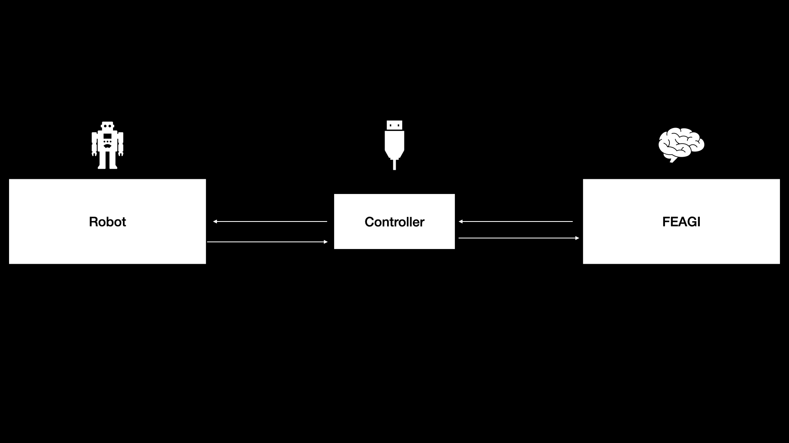

# The Role of the Controller


On the left is any type of embodiment, which can be WebSocket-based, serial-based, protobuf-based, socket-based, or any other protocol. It can also be a Bluetooth device, robotic arm, drone, or RC vehicle, depending on your embodiment's design. The controller's role in this image is to create a bridge that allows FEAGI to communicate with and control your embodiment while receiving data from both FEAGI and the robot.

When the robot sends data, such as sensor readings or camera feed, it passes through the controller. The controller then processes and sends the updated data to FEAGI. Similarly, when FEAGI wants to control the robot—for example, moving a wheel—it sends data to the controller, which converts the commands based on your robot's capabilities and transmits them in the robot's native protocol. The wheel then moves according to these translated commands. In this way, the controller facilitates bidirectional communication between FEAGI and your robot.


# Creation of Custom Controller
The controller enables communication between FEAGI and your robot. It is designed to allow FEAGI to control your embodiment (such as simulations, models, or physical robots).

If you want to connect FEAGI with your own robot, this is the right place for you. There are three different ways your controller can be used for: the Neurorobotics Studio website, Docker, or locally. The Neurorobotics Studio is a website that requires no setup. We also offer Docker and local options. Docker allows you to open a container without additional setup work. The local option lets you build source code directly and access FEAGI directly.

# How to Create Your Own Controller
Creating your own controller is a highly customizable process, and there is no single "right way" to approach it. This repository contains multiple controllers because there is no universal standard for generic devices or robots. However, many components share commonalities. For instance, accelerometers typically return x, y, and z coordinates, while batteries provide percentage values.

This guide will walk you through implementing and integrating controllers for new or unfamiliar devices.

---

## Requirements

To create a functional controller, you will need the following components:

1. **`capabilities.json`** - Available at [Controller configurator](https://github.com/feagi/controller_configurator)
2. **`networking.json`** - Included in the controller template
3. **`controller.py`** - Included in the controller template
4. **`requirements.txt`** - Included in the controller template
5. **`feagi_connector`** - Install using:  
   ```bash
   pip3 install feagi_connector
   ```
   


---

## Understanding `networking.json`

The `networking.json` file enables FEAGI to establish a connection with your controller. Below are the key fields and their purposes:

- **`feagi_host`**: Specifies the host address for FEAGI.  
  - If running locally, use `127.0.0.1`.  
  - To connect to another computer, replace this with that computer's IP address.
  
- **`magic_link`**: Can be updated by using the `--magic_link` flag such as `python3 controller.py --magic_link "your_magic_paste"

- **`feagi_api_port`**: Defaults to FEAGI's API port.

- **`feagi_url`**: Overrides `feagi_host`.  
  - If `feagi_url` matches `feagi_host`, it defaults to `feagi_host`.  
  - If using an API, SDK, or URL-based communication, it skips `feagi_host`.

- **Compression**: Enables ZMQ data compression to improve data exchange speed.

- **Agent-related fields**:
  - `agent_type`, `agent_id`, and `agent_data_port`: Used by FEAGI to map agents.

---

## Understanding `capabilities.json`

The `capabilities.json` file helps the FEAGI connector understand the features of your embodiment (e.g., simulation, robot, or any device). These capabilities are defined by the controller configurator.

### Data Types

There are two main types of data: **input (sensors)** and **output (actuators)**.

#### Actuators:
1. **Servo**: Used for incremental or degree-based positioning. Ideal for actuators requiring fixed positions.
2. **Motor**: Moves continuously and supports a "cool-down" feature (rolling window). For example:
   - A value of `1`: Power decreases from maximum to 0 immediately.
   - A value of `4`: Power decreases gradually (e.g., 400 → 300 → 200 → 100 → 0).
3. **LED**: Controls light sources such as LEDs, light bulbs, or screen backlights.
4. **Motion Control**: Handles yaw, roll, pitch, and other movement commands (e.g., godot, unreal, simulation, ps5 controller or robots).

#### Sensors:
1. **Camera**: Captures video or images for vision-based tasks.
2. **Infrared**: Detects light intensity (dark vs. bright).
3. **Proximity**: Measures distance using devices like LiDAR, ultrasonic sensors, or range finders.
4. **Pressure**: Measures force or flex (e.g., pressure sensors).
5. **Servo Position**: Tracks real-time servo positions using encoders or joint sensors.
6. **Gyro**: Reads gyroscopic data.
7. **Accelerometer**: Reads acceleration data along x, y, and z axes.
8. **Battery**: Monitors battery percentage in real time.

---

## Understanding `requirements.txt`

The `requirements.txt` file documents the dependencies required for your controller to function correctly. To check the installed version of the `feagi_connector`, run:

```bash
pip3 show feagi_connector
```

---

## Achieving Smooth Robot Movement

To ensure smooth operation and avoid conflicts between FEAGI and your robot's internal systems:

1. The robot should only receive action commands from FEAGI.
2. The robot should only send raw data streams back to FEAGI.
3. Avoid running additional code directly on the robot itself.

The controller acts as a communication bridge between your robot and FEAGI.

