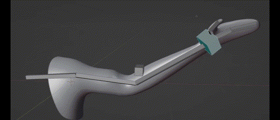

# Blender
## Information
- Version: 4+
- Programming: Python using Blender API only
- Network: ZMQ, UDP, or WS

## Setup Instructions
1. Install Blender
   - Download the latest stable version from: https://www.blender.org/download/
   - Note: Blender supports all major platforms (Windows, macOS, and Linux)
   - The Python interpreter comes bundled with the Blender installation
2. Familiarize yourself with Blender Python (bpy)
   - Start with the quickstart guide: https://docs.blender.org/api/current/info_quickstart.html#before-starting
   - This guide will help you understand:
     - Python console usage in Blender
     - Basic script execution
     - Object manipulation
     - Animation control
3. Study the API Documentation
   - Reference: https://docs.blender.org/api/current/info_overview.html
   - Focus on these key areas:
     - Object creation and manipulation
     - Property access and modification
     - Animation system
     - Data blocks and scene management
     - Custom property handling
     - Event handling system
4. Implement FEAGI Controller
   - Access the controller documentation: https://github.com/feagi/controllers/blob/main/README.md
   - You will need to develop code that:
     - Interfaces with Blender's Python API
     - Processes FEAGI signals into Blender commands
     - Sends object/scene data back to FEAGI

## Controller
Boilerplates are provided. A controller requires capabilities, networking, requirements.txt, and version specifications.

## Libraries
Feagi-connector is the library that enables communication with the brain (FEAGI). We need to create a controller for Blender.

## Troubleshooting
- Join our [Discord community](https://chat.expo.dev) to chat with other users and ask questions
- If you encounter issues building the controller, please create an issue in the repository

# Goal for this project
- Control the hand using FEAGI. See the example at the bottom, which is similar to the second video.
  Official Blender animation example showing manual hand movement:

  

    - Here is a video of FEAGI controlling the robotic hand (3:37 to 3:46):
https://youtu.be/u8Lw8djFQAY?t=217

    - Another example from 0:00 to 0:05:
https://www.youtube.com/watch?v=1ND9Sw5MaIk

The goal is to enable FEAGI to move any object in Blender, such as arms, eyes, eyebrows, hands, fingers, etc.

- FEAGI should have the capability to rig objects automatically. See this example from Blender:

- FEAGI should be able to update animation keyframes

- The end goal should look similar to this. You don't need to worry about the webcam - focus only on how FEAGI controls Blender.
See an example of the ideal result:

